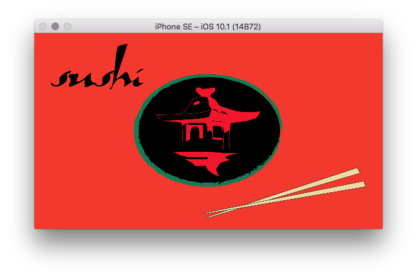
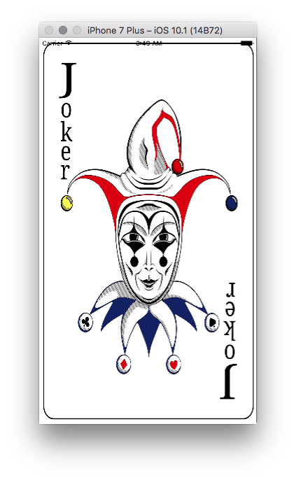

#SushiHangover.SVGKit

This is a `Xamarin.iOS` binding project for `SVGKit`

* SVGKit v2.x - live development, latest fixes/features
* Xamarin.iOS Version: 10.4.0.4
* Xcode 8.1 (11544) Build 8B62

##SVGKit

>SVGKit is a Cocoa framework for rendering SVG files natively: it's fast and powerful. Some additional info and links are on the wiki

Ref: [https://github.com/SVGKit/SVGKit](https://github.com/SVGKit/SVGKit)

License : [https://github.com/SVGKit/SVGKit/blob/2.x/LICENSE](https://github.com/SVGKit/SVGKit/blob/2.x/LICENSE)

##Nuget:

`PM> Install-Package SushiHangover.SVGKit.Binding`

Ref: [https://www.nuget.org/packages/SushiHangover.SVGKit.Binding](https://www.nuget.org/packages/SushiHangover.SVGKit.Binding)

##Issues?

###Binding Issues? [GitHub Issues](https://github.com/sushihangover/SVGKit.Binding/issues)

###SVGKit Library? [GitHub Issues](https://github.com/SVGKit/SVGKit/issues)

##Need Help?

Post general `SVGKit` questions on [StackOverflow](http://stackoverflow.com/questions/tagged/ios+svgkit)

Tagged:  **`[SVGKit]`** **`[iOS]`**

Specfic `Xamarin.iOS` & `SVGKit` questions on [StackOverflow] (http://stackoverflow.com/questions/tagged/ios+svgkit+xamarin+xamarin.ios)

Tagged: **`[XAMARIN]`** **`[SVGKit]`** **`[Xamarin.iOS]`** **`[iOS]`**

##Usage:

###Namespace: `SVGKit` 

	using SVGKit;

###Load SVG from a Bundle Resource

####Build action: `BundleResource`
	
	var image = new SVGKImage("Media/Sushi.svg");
	var imageView = new SVGKFastImageView(image);
	imageView.Frame = View.Frame;
	View.Add(imageView);

###Load SVG from a Bundle Path

####Build action: `Content`
	
	var image = new SVGKImage(Path.Combine(NSBundle.MainBundle.BundlePath, "Media/Joker.svg"));
	var imageView = new SVGKFastImageView(image);
	imageView.Frame = View.Frame;
	View.Add(imageView);

##Build:

###Building `SushiHangover.SVGKit.Binding`

#####`xbuild` or `msbuild` based:

	xbuild /p:SolutionDir=./ /target:Clean /p:Configuration=Release SushiHangover.SVGKit/SushiHangover.SVGKit.csproj
	xbuild /p:SolutionDir=./ /target:Build /p:Configuration=Release SushiHangover.SVGKit/SushiHangover.SVGKit.csproj
	
#####Building `Target:Release` also builds the Nuget package:

	bin/Release/SushiHangover.SVGKit.Binding.1.x.x.nupkg

###Building a static `SVGKit` library:

	pushd SVGKit
	xcodebuild -project SVGKit-iOS.xcodeproj clean
	xcodebuild -project SVGKit-iOS.xcodeproj
	xcrun -sdk iphoneos lipo -info build/Release-universal/libSVGKit-iOS.2.0.0.a
	popd

**Note:** The output from xcrun/lipo should contain `armv7` and `x86_64`
	

##Binding Info:

###Xamarin Binding Guide

[Binding Objective-C](https://developer.xamarin.com/guides/cross-platform/macios/binding/)

###Sharpie

	sharpie -tlm-do-not-submit bind --output=SushiHangover.SVGKit --namespace=SushiHangover.SVGKit --sdk=iphoneos10.1 ./SVGKit/build/Release-universal/usr/local/include/*.h

**Note:** This is from the solution root directory

	Binding Analysis:
	  Automated binding is complete, but there are a few APIs which have been flagged
	  with [Verify] attributes. While the entire binding should be audited for best API
	  design practices, look more closely at APIs with the following Verify attribute
	  hints:
	
	  MethodToProperty (35 instances):
	    An Objective-C method was bound as a C# property due to convention such as taking
	    no parameters and returning a value (non-void return). Often methods like these
	    should be bound as properties to surface a nicer API, but sometimes false-
	    positives can occur and the binding should actually be a method.
	
	  StronglyTypedNSArray (8 instances):
	    A native NSArray* was bound as NSObject[]. It might be possible to more strongly
	    type the array in the binding based on expectations set through API documentation
	    (e.g. comments in the header file) or by examining the array contents through
	    testing. For example, an NSArray* containing only NSNumber* instances can be
	    bound as NSNumber[] instead of NSObject[].
	
	  ConstantsInterfaceAssociation (1 instance):
	    There's no foolproof way to determine with which Objective-C interface an extern
	    variable declaration may be associated. Instances of these are bound as [Field]
	    properties in a partial interface into a nearby concrete interface to produce a
	    more intuitive API, possibly eliminating the 'Constants' interface altogether.
	
	  PlatformInvoke (14 instances):
	    In general P/Invoke bindings are not as correct or complete as Objective-C
	    bindings (at least currently). You may need to fix up the library name (it
	    defaults to '__Internal') and return/parameter types manually to conform to C
	    calling conventionsfor the target platform. You may find you don't even want to
	    expose the C API in your binding, but if you do, you'll probably also want to
	    relocate the definition to a more appropriate class and expose a stronger type-
	    safe wrapper. For P/Invoke guidance, see http://www.mono-project.com/docs/
	    advanced/pinvoke/.
